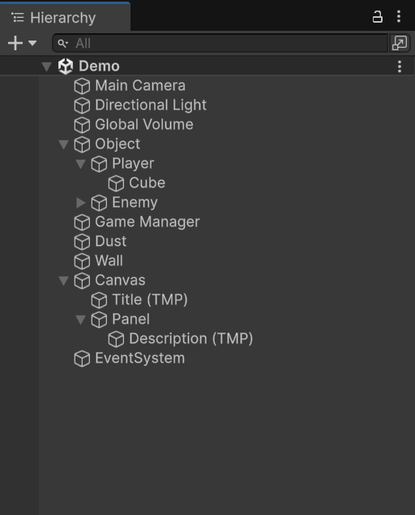
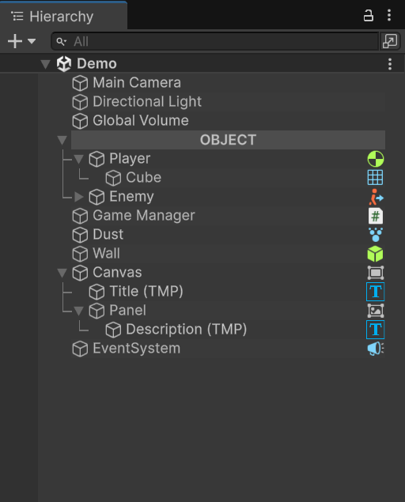

<h1 align="left">ER Hierarchy</h1>

###

The Hierarchy Editor is a custom tool designed to enhance the visual organization and management of GameObjects within Unity’s Hierarchy window. This tool provides a more intuitive and visually appealing interface that simplifies how developers interact with and structure objects in a scene. By adding visual cues such as gradient highlights, connector lines, and component icons, the Hierarchy Editor helps streamline the development workflow and improve clarity when working on complex scenes.

Enable this tool via Menu Item -> Tools -> ER Hierarchy -> Enable.

  <table>
    <tr>
      <td align="center"><strong>Before</strong></td>
      <td align="center"><strong>After</strong></td>
    </tr>
    <tr>
      <td align="center">
        
      </td>
      <td align="center">
        
      </td>
    </tr>
  </table>

###

<h2 align="left">Features</h2>

###

<ul align="left">
  <li><strong>Gradient Highlight for Each Object</strong> 
    Every GameObject in the Hierarchy is given a soft gradient highlight, making it easier to distinguish between objects and improving overall readability.
  </li> 
  <li><strong>Connector Lines Between Parent and Child Objects</strong> 
    Visual lines are drawn between parent and child GameObjects, clearly representing the hierarchy structure. This makes nested relationships more immediately visible and easier to follow.
  </li> 
  <li><strong>Component Icons Displayed Next to GameObject Names</strong> 
    If a GameObject has certain components (e.g., Rigidbody, Collider, Light), an appropriate icon is displayed beside the object’s name. This feature helps developers quickly identify the components attached to each object without needing to inspect them manually.
  </li> 
  <li><strong>Header Object Styling Using '---' Text</strong> 
    Users can turn any GameObject into a visual section header by including the text "---" in its name. This will apply a distinct styling to the object, visually separating it from other items and helping organize the hierarchy into clearly defined sections.
  </li>
</ul>

###
